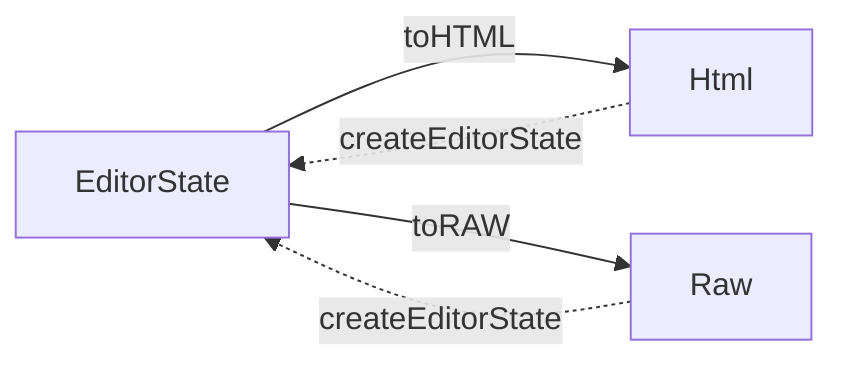

### 总结（BraftEditor）

#### 几个角色

##### EditorState, Raw, Html的转化

```mermaid
graph LR
EditorState--toHTML-->Html
Html-.createEditorState.->EditorState
EditorState--toRAW-->Raw
Raw-.createEditorState.->EditorState
```